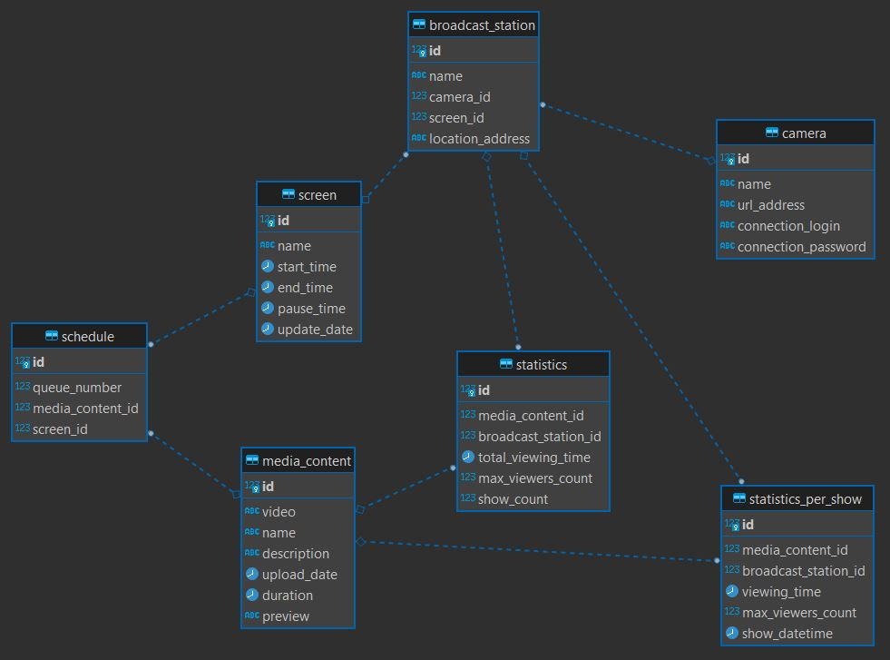

## Описание структуры базы данных

База данных проекта предназначена для управления трансляцией и аналитикой контента через камеры и экраны. Она включает таблицы для хранения информации о камерах, экранах, связях между ними, контенте, статистике и расписаниях трансляций.

### ER-Диаграмма

### Таблицы базы данных

#### `camera` - Камеры
- `id`: Уникальный автоинкрементный идентификатор камеры.
- `name`: Название камеры.
- `url_address`: Общедоступный IP-адрес или DNS-адрес для доступа к камере.
- `connection_login`: Логин для доступа к камере.
- `connection_password`: Пароль для доступа к камере.

#### `screen` - Экраны
- `id`: Уникальный автоинкрементный идентификатор экрана.
- `name`: Название экрана.
- `start_time`: Время начала трансляции контента на экране.
- `end_time`: Время окончания трансляции контента на экране.
- `pause_time`: Время паузы между показами видео.
- `update_date`: Дата обновления проигрываемого на экране контента.

#### `camera_screen` - Станция для трансляции контента (Связующая таблица камеры и экрана)
- `id`: Уникальный автоинкрементный идентификатор связи.
- `name`: Название станции.
- `camera_id`: Ссылка на идентификатор камеры.
- `screen_id`: Ссылка на идентификатор экрана.
- `location_address`: Локация (адрес), где расположена станция.

#### `media_content` - Транслируемый контент
- `id`: Уникальный автоинкрементный идентификатор контента.
- `video`: Путь к файлу видео в файловой системе.
- `name`: Название контента.
- `description`: Описание контента.
- `upload_date`: Дата загрузки видео.
- `duration`: Продолжительность видео.
- `preview`: Путь к изображению превью видео в файловой системе.

#### `schedule` - Расписание показа контента
- `id`: Уникальный автоинкрементный идентификатор записи в расписании.
- `queue_number`: Порядковый номер контента в очереди трансляции.
- `media_content_id`: Ссылка на транслируемый контент.
- `screen_id`: Ссылка на экран, транслирующий контент.

#### `statistics` - Статистика по показам контента на каждой станции
- `id`: Уникальный автоинкрементный идентификатор записи статистики.
- `media_content_id`: Ссылка на транслируемый контент.
- `broadcast_station_id`: Ссылка на станцию, транслирующую контент и анализирующую заинтересованность публики
- `total_viewing_time`: Общее время просмотра контента.
- `max_viewers_count`: Максимальное количество зрителей в момент времени.
- `show_count`: Количество показов контента.

#### `statistics_per_show` - Статистика по каждому отдельному показу контента
- `id`: Уникальный автоинкрементный идентификатор статистики кадра.
- `media_content_id`: Ссылка на контент, для которого записывается статистика.
- `broadcast_station_id`: Ссылка на станцию, транслирующую контент и анализирующую заинтересованность публики
- `viewing_time`: Время просмотра данного кадра.
- `max_viewers_count`: Максимальное количество зрителей в момент времени.
- `show_datetime`: Дата и время трансляции.

### Основные особенности

- Все таблицы используют `SERIAL` для первичных ключей, что обеспечивает уникальность и автоматическое увеличение ID.
- Используются внешние ключи для поддержания реляционной целостности между таблицами.
- Длина строковых полей варьируется для размещения различных типов информации от 50 до 360 символов.
